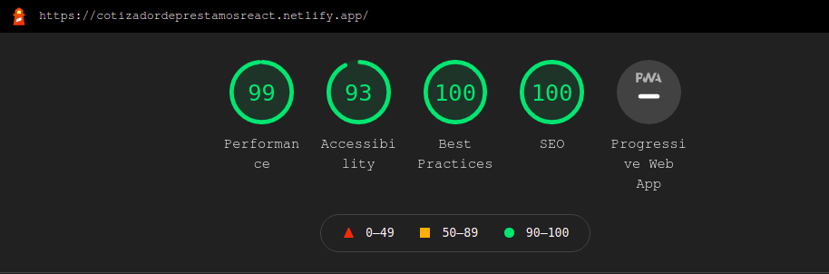
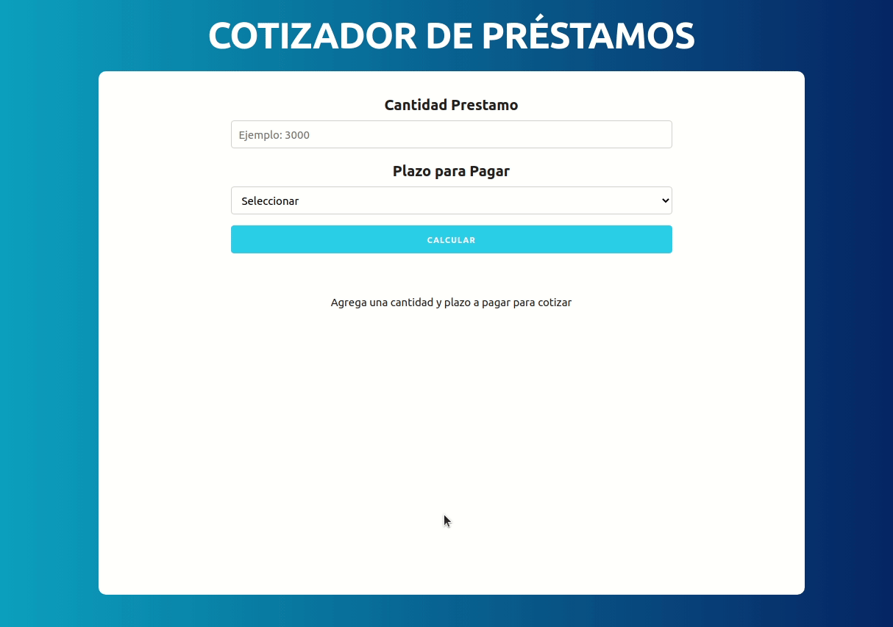

<!-- PROJECT LOGO -->
<br />
<p align="center">
<h4 align="center">Cotizador de préstamos</h4>
  <p align="center">
    <a href="https://cotizadordeprestamosreact.netlify.app/">View Web Application</a>
  </p>
  <p align="center">

</p>
<p align="center">
</p>

<p align="center">
</p
</p>

<!-- TABLE OF CONTENTS -->
<details open="open">
  <summary>Table of Contents</summary>
  <ol>
    <li><a href="#prerequisites">Prerequisites</a></li>
    <li><a href="#installation">Installation</a></li>
    <li><a href="#about-the-project">About The Project</a></li>
    <li><a href="#app-overview">App Overview</a></li>
    <li><a href="#languages-and-tools">Languages and Tools</a></li>
    <li><a href="#contact">Contact</a></li>
  </ol>
</details>  

## Learn more

To be more familiar with the libraries and frameworks I have mainly used I will leave a short explanation here:  

### [Skeleton](http://getskeleton.com/)

Skeleton is a lightweight CSS framework or boilerplate, more specifically, it’s two CSS files: the popular normalize.css file and the skeleton.css file. The most important part of Skeleton is its grid system.  Additionally, the framework provides basic styles for common HTML components like buttons, lists, tables, and forms.


### Prerequisites  
- [Node](https://nodejs.org/en/): 10.16.0 or more
- [React js](https://es.reactjs.org/)- Clone the repository on your local machine (https://github.com/l0g0l/cotizadorPrestamos.git)

## Installation


```sh
cd cotizadorPrestamos go into the folder
```


```sh
npm init

```
```sh
npm start

```


<!-- ABOUT THE PROJECT -->

## About The Project

Building a loan quoter using React js in functional and useState hook.
CSS is made with Skeleton


### Requirements  

-Develop a web aplication with HTML, CSS with Skeleton, JavaScript and React js.  
-Deploy
-Version control management with GiT.


<!-- APP OVERVIEW -->

## App Overview  



<br>

<!-- ACKNOWLEDGEMENTS -->

## Languages and Tools:


The project is deployed in [Netlifly](https://www.netlify.com/)  
<br>

<p align="left">
 <a href="https://www.w3.org/html/" target="_blank">  </a>  
    <a href="https://developer.mozilla.org/en-US/docs/Web/JavaScript" target="_blank">
        
    </a>
        <a href="https://www.react.com/" target="_blank">
        
    </a>
    <a href="https://git-scm.com/" target="_blank">
        
    </a>
     <a href="https://www.netlify.com/" target="_blank">
        
    </a>
    
</p>

<!-- CONTACT -->

## Contact

Lucía González

[](https://github.com/l0g0l)

[](https://www.linkedin.com/in/luciagonzalezlara)